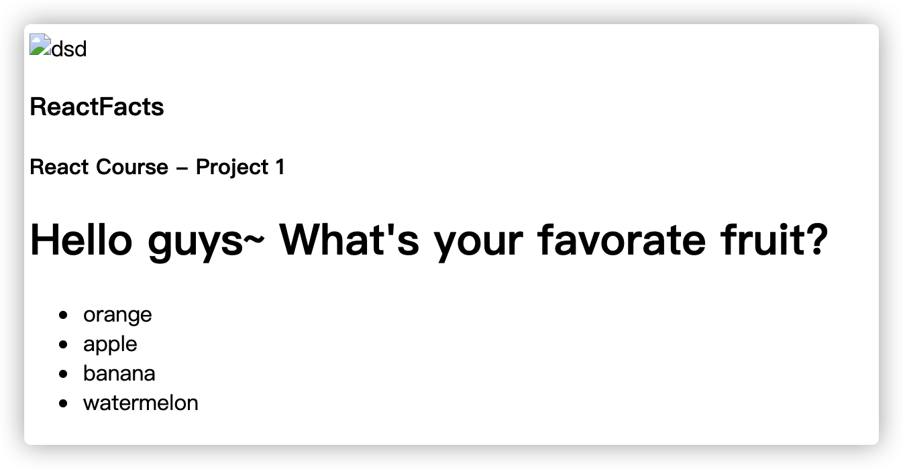

### 1. build an react info site

#### index.html

```
<html>
    <head>
        <link rel="stylesheet" href="index.css">
    </head>
    <body>
        <div id="test"></div>
        <script src="index.pack.js"></script>
    </body>
</html>

```

#### index.js

```
import React from "react"
import ReactDOM from "react-dom"

import App from "./App"

ReactDOM.render(<App />, document.getElementById("test"))
```

#### App.js

```
import React from "react"
import Navbar from "./component/Navbar.js"
import Main from "./component/Main.js"

export default function App() {
    return (
        <div className="container">
            <Navbar />
            <Main />
        </div>
    )
}
```

#### style.css

```
* {
    box-sizing: border-box;
}

body {
    margin: 0;
    font-family: Inter, sans-serif;
    height: 100vh;
    background-color: #282D35;
}

nav {
    display: flex;
    align-items: center;
    background-color: #21222A;
    height: 90px;
    padding: 30px 25px;
}

.nav--logo_text, .nav--title {
    margin: 0;
}

.nav--logo_text {
    margin-right: auto;
    color: #61DAFB;
    font-weight: 700;
    font-size: 22px;
}

.nav--title {
    color: #DEEBF8;
    font-weight: 600;
}

.nav--icon {
    height: 30px;
    margin-right: 7px;
}

main {
    padding: 57px 27px;
    color: white;
    background-image: url(./images/react-icon-large.png);
    background-repeat: no-repeat;
    background-position: right 75%;
}

.main--title {
    margin: 0;
    font-size: 39px;
    letter-spacing: -0.05em;
}

.main--facts {
    margin-top: 46px;
    max-width: 400px;
}

.main--facts > li {
    line-height: 19px;
    padding-block: 10px;
}

.main--facts > li::marker {
    font-size: 1.4rem;
    color: #61DAFB;
}
```

#### Main.js
```
import React from "react";

export default function Main (){
    return(
        <div>
        <h1 className="main--title">Hello guys~ What's your favorate fruit?</h1>
        <ul className="main--facts">
            <li>orange</li>
            <li>apple</li>
            <li>banana</li>
            <li>watermelon</li>
        </ul>
        </div>
    )
}
```

#### Navbar.js
```

```
import React from "react";

export default function Navbar (){
  return(
      <nav>
          
          <h3 className="nav--logo_text">ReactFacts</h3>
            <h4 className="nav--title">React Course - Project 1</h4>
      </nav>
  )
}

### 页面效果：


### 疑问：
  #### 1）react 的logo图片显示不出来；
  #### 2）index.html文件 链接不了 index.css，以致样式加载不出来，明天再去研究下。