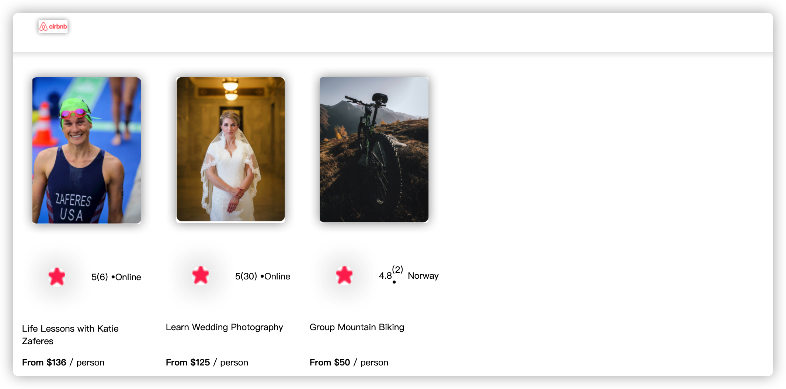

### 今天做的是关于一些卡片的react项目，这个之前有练习，主要遇到的问题是Css样式不对，跟图片素材也有点关系。磕磕碰碰算是弄出来了。
### 效果图如下：



### 以下是做的一些项目代码：

### 1. build an react experience card project

#### index.html
```
<html>
    <head>
        <link rel="stylesheet" href="index.css">
    </head>
    <body>
        <div id="test"></div>
        <script src="index.pack.js"></script>
    </body>
</html>

```

#### index.js

```
import React from "react"
import ReactDOM from "react-dom"

import App from "./App"

ReactDOM.render(<App />, document.getElementById("test"))
```

#### App.js

```
import React from "react"
import Navbar from "./component/Navbar.js"
import Card from "./component/Card.js"
import data from "./data.js"

export default function App() {
    
    const cards =data.map(item =>{
        return (
            <Card 
              key={item.id}
              img={item.coverImg}
              rating={item.stats.rating}
              reviewCount={item.stats.reviewCount}
              location = {item.location}
              title={item.title}
              price = {item.price}
            />
        )
    })
    
    return (
        <div >
            <Navbar />
            <section className="cards-list">
                {cards}
            </section>
        </div>
    )
}
```

#### style.css

```
* {
    box-sizing: border-box;
}

body {
    margin: 0;
    font-family: Inter, sans-serif;
    height: 100vh;
    background-color: #282D35;
}

/* 虚拟组件 Dom 可以直接当做一个元素来定义Css 样式 */
nav { 
    display: flex;
    align-items: center;
    background-color: #21222A;
    height: 90px;
    padding: 30px 25px;
}

.nav--logo_text, .nav--title {
* {
    box-sizing: border-box;
}

body {
    margin: 0;
    font-family: Inter, sans-serif;
    height: 100vh;
    background-color: #282D35;
}

/* 虚拟组件 Dom 可以直接当做一个元素来定义Css 样式 */
nav { 
    display: flex;
    align-items: center;
    background-color: #21222A;
    height: 90px;
    padding: 30px 25px;
}

.nav--logo_text, .nav--title {
* {
    box-sizing: border-box;
}

body {
    margin: 0;
    font-family: Inter, sans-serif;
    height: 100vh;
    background-color: #282D35;
}

/* 虚拟组件 Dom 可以直接当做一个元素来定义Css 样式 */
nav { 
    display: flex;
    align-items: center;
    background-color: #21222A;
    height: 90px;
    padding: 30px 25px;
}

.nav--logo_text, .nav--title {
* {
    box-sizing: border-box;
}

body {
    margin: 0;
    font-family: Inter, sans-serif;
    height: 100vh;
    background-color: #282D35;
}

/* 虚拟组件 Dom 可以直接当做一个元素来定义Css 样式 */
nav { 
    display: flex;
    align-items: center;
    background-color: #21222A;
    height: 90px;
    padding: 30px 25px;
}

.nav--logo_text, .nav--title {
* {
    box-sizing: border-box;
}

body {
    margin: 0;
    font-family: Inter, sans-serif;
    height: 100vh;
    background-color: #282D35;
}

/* 虚拟组件 Dom 可以直接当做一个元素来定义Css 样式 */
nav { 
    display: flex;
    align-items: center;
    background-color: #21222A;
    height: 90px;
    padding: 30px 25px;
}

.nav--logo_text, .nav--title {
* {
    box-sizing: border-box;
}

body {
    margin: 0;
    font-family: Inter, sans-serif;
    height: 100vh;
    background-color: #282D35;
}

/* 虚拟组件 Dom 可以直接当做一个元素来定义Css 样式 */
nav { 
    display: flex;
    align-items: center;
    background-color: #21222A;
    height: 90px;
    padding: 30px 25px;
}

.nav--logo_text, .nav--title {
* {
    box-sizing: border-box;
}

body {
    margin: 0;
    font-family: Inter, sans-serif;
    height: 100vh;
    background-color: #282D35;
}

/* 虚拟组件 Dom 可以直接当做一个元素来定义Css 样式 */
nav { 
    display: flex;
    align-items: center;
    background-color: #21222A;
    height: 90px;
    padding: 30px 25px;
}

.nav--logo_text, .nav--title {
* {
  box-sizing: border-box;
}

body {
  margin: 0;
  font-family: 'Poppins', sans-serif;
}

nav {
  height: 70px;
  display: flex;
  padding: 20px 36px;
  box-shadow: 0px 2.98256px 7.4564px rgba(0, 0, 0, 0.1);
}

.bold {
  font-weight: bold;
}

.gray {
  color: #918E9B;
}

.nav--logo {
  max-width: 100px;
}

section {
  padding: 20px;
}

.hero {
  display: flex;
  flex-direction: column;
}

.hero--photo {
  max-width: 400px;
  align-self: center;
}

.hero--header {
  margin-bottom: 16px;
}

.hero--text {
  margin-top: 0;
}

.cards-list {
  display: flex;
  flex-wrap: nowrap;
  gap: 20px;
  overflow-x: auto;
}

.card {
  width: 175px;
  font-size: 12px;
  flex: 0 0 auto;         /* ADD */
  display: flex;          /* ADD */
  flex-direction: column; /* ADD */
}

.card--image {
  width: 100%;
  border-radius: 9px;
  margin-bottom: 9px;
}

/* ADD */
.card--title {
  overflow: hidden;
  text-overflow: ellipsis;
}

.card--stats {
  display: flex;
  align-items: center;
}

.card--star {
  height: 14px;
  width: 14px;
}

/* ADD */
.card--price {
  margin-top: auto;
}
```

#### Navbar.js
```
import React from "react";
import "../index.css"; /* 注：一定要在 自定义组件js里引用 "index.css"!!! */

export default function Navbar() {
  return (
    /*Nav这里不一定要定义className的属性给它 */
    <nav>
      
    </nav>
  );
}

```

#### Card.js
```
import React from "react";

export default function Card (props){
    return(
        <div className="card">
            </img>
            <div className="card--stats">
                
                <span>{props.rating}</span>
                <span className="grey">({props.reviewCount}) • </span>
                <span className="grey">{props.location}</span>
            </div>
            <p className="card--title">{props.title}</p>
            <p className="card--price"> <span  className="bold">From ${props.price}</span> / person</p>
        </div>
    )
}
```

#### data.js
```
export default  [
    {
        id: 1,
        title: "Life Lessons with Katie Zaferes",
        description: "I will share with you what I call \"Positively Impactful Moments of Disappointment.\" Throughout my career, many of my highest moments only came after setbacks and losses. But learning from those difficult moments is what gave me the ability to rise above them and reach my goals.",
        price: 136,
        coverImg: "swimmer.png",
        stats: {
            rating: 5.0,
            reviewCount: 6
        },
        location: "Online",
        openSpots: 0,
    },
    {
        id: 2,
        title: "Learn Wedding Photography",
        description: "Interested in becoming a wedding photographer? For beginner and experienced photographers alike, join us in learning techniques required to leave the happy couple with memories that'll last a lifetime.",
        price: 125,
        coverImg: "wedding.png",
        stats: {
            rating: 5.0,
            reviewCount: 30
        },
        location: "Online",
        openSpots: 27,
    },
    {
        id: 3,
        title: "Group Mountain Biking",
        description: "Experience the beautiful Norwegian landscape and meet new friends all while conquering rugged terrain on your mountain bike. (Bike provided!)",
        price: 50,
        coverImg: "biking.png",
        stats: {
            rating: 4.8,
            reviewCount: 2
        },
        location: "Norway",
        openSpots: 3,
    }
]
```

