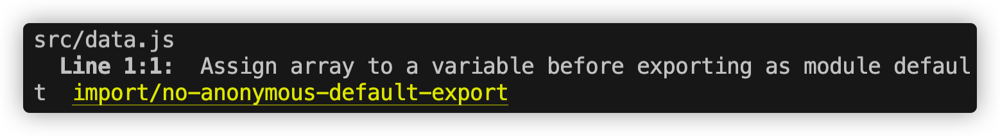

# Project3

### (1)关于昨天做的练习有个编译上的 warning



### 所以在这里要给 数组传个变量

```js
const da = [];
export default da;
```

### (2)今天做第三个项目，做了一部分的页面，其中点击事件不生效，这个明天再看


### 以下是做的一些项目代码

### 1. build an react experience card project

#### index.html

```html
<html>
  <head>
    <link rel="stylesheet" href="index.css" />
  </head>
  <body>
    <div id="test"></div>
    <script src="index.pack.js"></script>
  </body>
</html>
```

#### index.js

```
import React from "react"
import ReactDOM from "react-dom"

import App from "./App"

ReactDOM.render(<App />, document.getElementById("test"))
```

#### App.js

```

import Header from './components/Header';
import Meme from './components/meme';

function App (){
  return (
    <div>
      <Header />
      <Meme />
    </div>
  )
}

export default App;

```

/src/component/Card.js

```css
* {
  box-sizing: border-box;
}

body {
  font-family: "Karla", sans-serif;
  margin: 0;
}

.header {
  display: flex;
  align-items: center;
  height: 65px;
  background: linear-gradient(90deg, #672280 1.18%, #a626d3 100%);
  color: white;
  padding: 20px;
}

.header--image {
  height: 100%;
  margin-right: 6px;
}

.header--title {
  font-size: 1.25rem;
  margin-right: auto;
}

.header--project {
  font-size: 12px;
  font-weight: 500;
}

.form {
  display: grid;
  grid-template: 40px 40px / 1fr 1fr;
  gap: 17px;
  padding: 40px;
}
.form--input {
  border-radius: 5px;
  border: 1px solid green;
  text-indent: 5px;
}
.form--button {
  grid-column: 1/-1;
  font-family: "Karla", sans-serif;
  border-radius: 5px;
  background: linear-gradient(90.5deg, #711f8d 1.14%, #a818da 100%);
  color: white;
  border: none;
  cursor: pointer;
}
```

#### Header.js

```
import React  from "react"
import  "../index.css";
export default function Header () {
   return (
       <header className="header">
           
           <h2 className="header--title">Header component</h2>
           <h4 className="header--project">React Course - Project 3</h4>
       </header>
   )
}
```

#### meme.js

```
import React from "react";
import memesData from "../memesData";
export default function Meme (){

     let url;
      function getImageUrl(){
     const memesArray = memesData.data.memes;
     const randomNumber = Math.floor(Math.random() * memesArray.length);
        url = memesArray[randomNumber].url;
        console.log(url);
      }

    return(
        <main>
            <form className="form">
                <input
                 type="text"
                 placeholder="Top text"
                 className="form--input"
                />
                  <input
                 type="text"
                 placeholder="Bottom text"
                 className="form--input"
                />
                <button className="form--button" onClick={getImageUrl}
                >
                    Get a new meme image
                </button>
            </form>
        </main>
    )
}
```

#### memesData.js

```
 const memesData =   {
    "success":"true",
    "data":{
        "memes":[
            {
                "id": "181913649",
                "name": "Drake Hotline Bling",
                "url": "https://i.imgflip.com/30b1gx.jpg",
                "width": 1200,
                "height": 1200,
                "box_count": 2
            },
            {
                "id": "87743020",
                "name": "Two Buttons",
                "url": "https://i.imgflip.com/1g8my4.jpg",
                "width": 600,
                "height": 908,
                "box_count": 3
            },
            {
                "id": "112126428",
                "name": "Distracted Boyfriend",
                "url": "https://i.imgflip.com/1ur9b0.jpg",
                "width": 1200,
                "height": 800,
                "box_count": 3
            }
        ]
    }
}

export default memesData;
```
