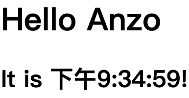

# 关于React state笔记

  1. 这个显示动态时间的clock组件依然运用了state的特性，利用class 组件可以运用生命周期的特性来放置 setInterval()，其中对setState()的用法不是很理解，需要再花时间看一下。

## Clock.js

 ```js
   class Clock extends React.Component {
  constructor (props){
     super(props);
     this.state = { 
       date: new Date()
     }
  }
  
  componentDidMount(){
   this.timeID = setInterval(()=> this.tick() ,1000 );
 }
  
  componentWillUnmount(){
    clearInterval(this.timeID);
  }
  
  tick(){
    this.setState({
       date: new Date()
     })
  }
   
  render(){
    return(
    <div>
        <h1> Hello Anzo</h1>
        <h2>It is {this.state.date.toLocaleTimeString()}!</h2>
    </div>    
    )
  }
  
}

ReactDOM.render(
   <Clock />,
  document.getElementById("root")
);
 ```

## 效果如下

 
